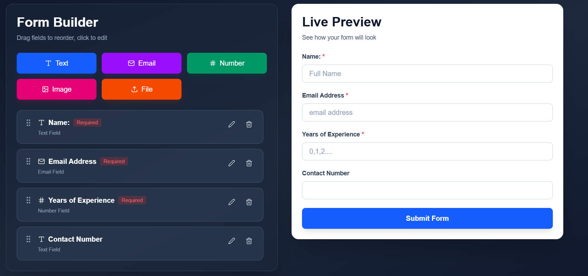
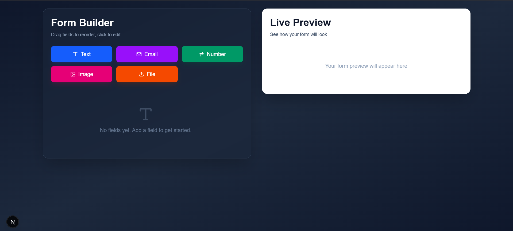
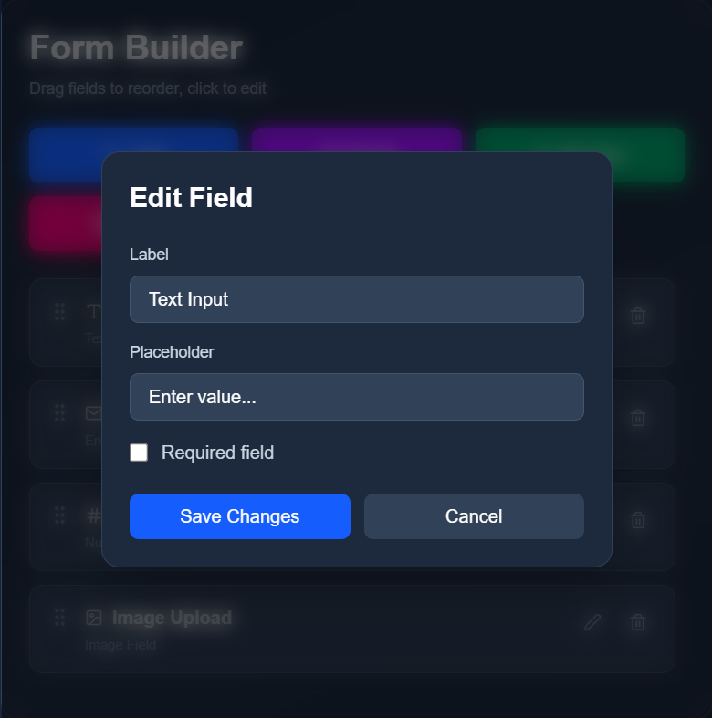
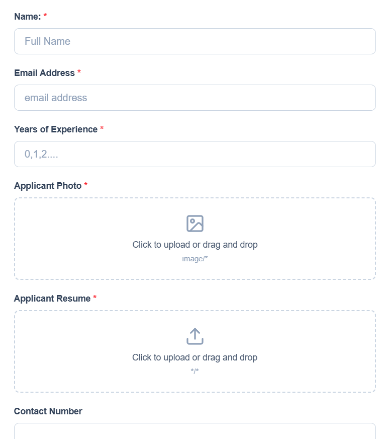
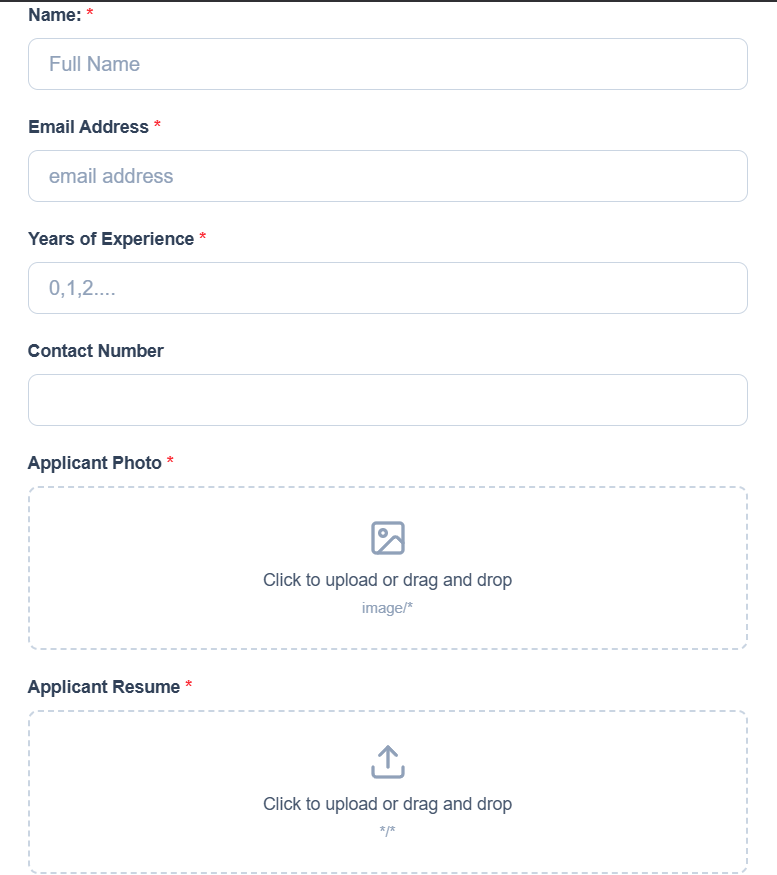

# Professional Form Builder

A modern, drag-and-drop form builder built with React, TailwindCSS and Next.js. Create beautiful forms with ease using an intuitive interface and live preview.



## Features

- 🎯 **Drag & Drop Interface** - Easily reorder form fields by dragging
- 📝 **Multiple Field Types** - Text, Email, Number, Image Upload, and File Upload
- ✏️ **Live Editing** - Edit field properties in real-time with a modal dialog
- 👁️ **Live Preview** - See exactly how your form will look as you build it
- 💾 **Auto-Save** - Form configuration automatically saved to session storage
- 🎨 **Modern UI** - Beautiful dark theme with smooth animations
- 📱 **Responsive Design** - Works perfectly on desktop and mobile devices
- 🔒 **Field Validation** - Mark fields as required
- 📎 **File Type Control** - Specify accepted file types for uploads

## Screenshots

### Form Builder Interface


### Field Editing Modal


### Live Preview Panel


## Prerequisites

- Node.js 16.x or higher
- npm, yarn, or pnpm

## 🛠️ Built With

- **[Next.js](https://nextjs.org/)** - React framework for production
- **[React](https://reactjs.org/)** - JavaScript library for building user interfaces
- **[Tailwind CSS](https://tailwindcss.com/)** - Utility-first CSS framework
- **[Lucide React](https://lucide.dev/)** - Beautiful & consistent icons

## Dependencies
```json
{
  "react": "^18.x",
  "next": "^14.x",
  "lucide-react": "latest",
  "tailwindcss": "^3.x"
}
```

## Usage

### Adding Fields

Click on any of the colored buttons to add a field type:
- **Text** - Standard text input
- **Email** - Email validation input
- **Number** - Numeric input
- **Image** - Image file upload
- **File** - Any file type upload

### Editing Fields

1. Click the **Edit** button (pencil icon) on any field
2. Modify the label, placeholder, or other properties
3. Toggle the "Required" checkbox if needed
4. For file/image fields, specify accepted file types
5. Click **Save Changes**

### Reordering Fields

Simply drag any field to a new position using the grip handle icon.

#### Old Order Form & Panel



#### New Order Form & Panel



### Deleting Fields

Click the **Delete** button (trash icon) on any field to remove it.

## Customization

### Changing Colors

Edit the Tailwind classes in the component to match your brand:
```javascript
// Example: Change button colors
className="bg-blue-600 hover:bg-blue-700" // Change to your color
```

### Adding New Field Types

1. Add the field type to `addField` function
2. Add corresponding icon in `getFieldIcon`
3. Add button in the UI
4. Handle rendering in the preview section

## Contributing

Contributions are welcome! Please feel free to submit a Pull Request.

1. Fork the project
2. Create your feature branch (`git checkout -b feature/AmazingFeature`)
3. Commit your changes (`git commit -m 'Add some AmazingFeature'`)
4. Push to the branch (`git push origin feature/AmazingFeature`)
5. Open a Pull Request

## Acknowledgments

- Icons by [Lucide](https://lucide.dev/)
- Design inspiration from modern form builders
- Built with ❤️ using Next.js and React
